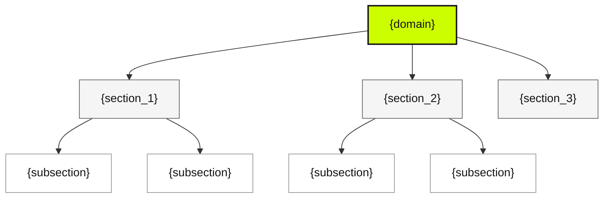
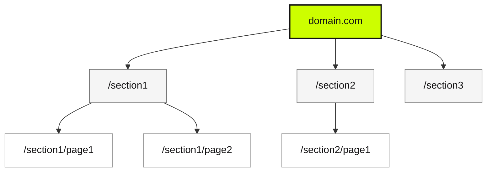
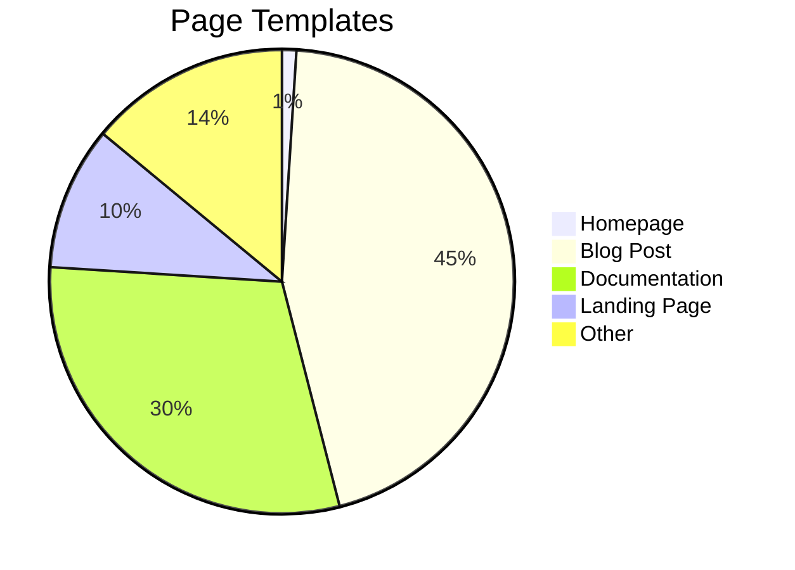
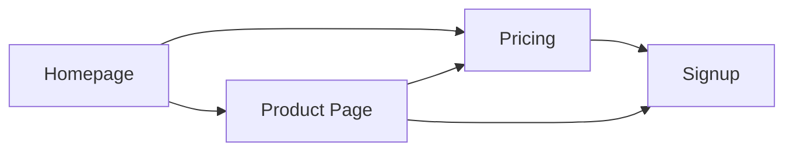

# Output Templates

Complete Markdown scaffolds for the two deliverable files.

---

## site-map-report.md Template

````markdown
# Site Intelligence Report: {domain}

> Generated: {date} | Mode: {Quick|Deep} | Pages analyzed: {n} | Confidence: {High|Medium|Low}

---

## Executive Summary

{2-3 paragraphs covering:

- Site purpose and target audience
- Key structural observations
- Most significant findings (positive and negative)
- Primary recommendation}

---

## Site Architecture

### Hierarchy Diagram



### Navigation Structure

| Level                | Pages | Examples   |
| -------------------- | ----- | ---------- |
| L0 (Root)            | 1     | {homepage} |
| L1 (Primary nav)     | {n}   | {examples} |
| L2 (Section content) | {n}   | {examples} |
| L3+ (Deep content)   | {n}   | {examples} |

### URL Structure Analysis

**Patterns observed:**

- {pattern observation 1}
- {pattern observation 2}

**Consistency notes:**

- {consistency observation}

---

## Content Clusters

| Cluster       | URL Count | Sample Pages   |
| ------------- | --------- | -------------- |
| Blog          | {n}       | {url1}, {url2} |
| Documentation | {n}       | {url1}, {url2} |
| Products      | {n}       | {url1}, {url2} |
| Resources     | {n}       | {url1}, {url2} |
| Utility       | {n}       | {url1}, {url2} |
| Other         | {n}       | {url1}, {url2} |

{If >50 URLs total, use collapsible:}

<details>
<summary>Full URL list ({total} URLs)</summary>

**Blog ({n})**

- {url}
- {url}

**Documentation ({n})**

- {url}
- {url}

{...continue for each cluster}

</details>

---

## Template Families

| Template        | Page Count | Dominant Sections | User Goal |
| --------------- | ---------- | ----------------- | --------- |
| {template_name} | {n}        | {section_list}    | {goal}    |
| {template_name} | {n}        | {section_list}    | {goal}    |

### {Template Name 1}

**Representative URLs:**

- {url1}
- {url2}

**Sections typically present:**

- {section}: {description}
- {section}: {description}

**User journey:** {description of what user does on this page type}

### {Template Name 2}

{repeat structure}

---

## Internal Linking

### Link Statistics

| Metric                              | Value                     |
| ----------------------------------- | ------------------------- |
| Average internal links per page     | {n}                       |
| Most linked page                    | {url} ({n} inbound links) |
| Least linked content page           | {url} ({n} inbound links) |
| Orphan pages (0 inbound)            | {n}                       |
| Navigation links (in header/footer) | {n}                       |

### Link Graph Observations

- {observation about linking patterns}
- {observation about hub pages}
- {observation about potential issues}

{For Deep mode, optionally include link matrix or top pages:}

**Top 10 Most Linked Pages:**

| Page  | Inbound Links |
| ----- | ------------- |
| {url} | {n}           |
| {url} | {n}           |

---

## SEO Overview

### Metadata Quality

| Element           | Coverage           | Quality Notes |
| ----------------- | ------------------ | ------------- |
| Title tags        | {n}/{total} ({%}%) | {observation} |
| Meta descriptions | {n}/{total} ({%}%) | {observation} |
| H1 tags           | {n}/{total} ({%}%) | {observation} |
| Open Graph tags   | {n}/{total} ({%}%) | {observation} |
| Canonical tags    | {n}/{total} ({%}%) | {observation} |
| Structured data   | {n}/{total} ({%}%) | {observation} |

### SEO Strengths

- {strength 1}
- {strength 2}

### SEO Issues

| Issue   | Severity                   | Pages Affected | Recommendation |
| ------- | -------------------------- | -------------- | -------------- |
| {issue} | {Critical/High/Medium/Low} | {n}            | {fix}          |
| {issue} | {severity}                 | {n}            | {fix}          |

### Technical SEO Signals

- **Indexability:** {observation}
- **Canonicalization:** {observation}
- **Redirects observed:** {observation}
- **Sitemap:** {present/not found}
- **Robots.txt:** {observation}

---

## Performance Observations

### Page Weight Indicators

| Indicator                   | Pages Affected | Notes         |
| --------------------------- | -------------- | ------------- |
| Image-heavy (>20 images)    | {n}            | {urls if few} |
| Embedded video              | {n}            | {urls if few} |
| Many external scripts (>10) | {n}            | {observation} |
| Third-party domains loaded  | {n} domains    | {list if <10} |

### Potential Concerns

- {concern 1 with specifics}
- {concern 2 with specifics}

### Positive Signals

- {positive observation}

---

## Statistics

| Metric                       | Value      |
| ---------------------------- | ---------- |
| Total URLs discovered        | {n}        |
| Pages analyzed in detail     | {n}        |
| Template families identified | {n}        |
| Maximum click depth          | {n} levels |
| Pages with forms             | {n}        |
| Pages with CTAs              | {n}        |
| Pages with video             | {n}        |
| Average word count           | {n} words  |
| Total internal links         | {n}        |
| Total external links         | {n}        |

---

## Risks, Anomalies & Opportunities

### Risks

| Risk               | Severity                   | Impact            | Recommendation |
| ------------------ | -------------------------- | ----------------- | -------------- |
| {risk description} | {Critical/High/Medium/Low} | {business impact} | {action}       |
| {risk description} | {severity}                 | {impact}          | {action}       |

### Anomalies

- {unexpected finding 1}
- {unexpected finding 2}

### Opportunities

| Opportunity   | Impact            | Effort     | Recommendation |
| ------------- | ----------------- | ---------- | -------------- |
| {opportunity} | {High/Medium/Low} | {estimate} | {action}       |
| {opportunity} | {impact}          | {effort}   | {action}       |

---

## Methodology & Confidence

### Analysis Mode

**{Quick Mode | Deep Mode}**

{For Quick Mode:}

> This analysis used Web Search and WebFetch tools for reconnaissance. Structural details are inferred from content rather than DOM inspection. Results should be considered directional guidance.

{For Deep Mode:}

> This analysis used Firecrawl MCP for comprehensive crawling and HTML structure analysis. Section detection used semantic HTML tags and class name pattern matching.

### Data Sources

| Source        | Details                       |
| ------------- | ----------------------------- |
| URL discovery | {firecrawl_map / web search}  |
| Pages scraped | {n}                           |
| Formats used  | {html, links, markdown, etc.} |
| Analysis date | {date}                        |

### Confidence Levels

| Analysis Area     | Confidence        | Basis                                        |
| ----------------- | ----------------- | -------------------------------------------- |
| Site hierarchy    | {High/Medium/Low} | {Observed from crawl / Inferred from search} |
| Template families | {High/Medium/Low} | {DOM fingerprinting / Content inference}     |
| SEO coverage      | {High/Medium/Low} | {Direct meta extraction / Partial data}      |
| Internal linking  | {High/Medium/Low} | {Full link graph / Sampled pages}            |
| Performance       | {High/Medium/Low} | {HTML analysis / Limited signals}            |

### Limitations

- {limitation 1 - what couldn't be determined}
- {limitation 2 - JS-heavy content notes}
- {limitation 3 - auth-gated areas}
- {limitation 4 - sample size constraints}

---

_Report generated by Website Intelligence Skill_
````

---

## page-diagrams.md Template

````markdown
# Page Structure Diagrams: {domain}

> Generated: {date} | Templates documented: {n}

---

## Diagram Legend

```
+==========================================+
||  SECTION-TYPE: description             ||  ← Double border = page container
+==========================================+

+------------------------------------------+
|  SECTION-TYPE: description               |  ← Section container
+------------------------------------------+

|  [element]  [element]  [element]         |  ← Inline elements (buttons, links)

|  +--------+ +--------+ +--------+        |  ← Grid/card layouts
|  | card 1 | | card 2 | | card 3 |        |
|  +--------+ +--------+ +--------+        |

|  "Quoted text represents headlines"      |  ← Text content

|  {variable content}                      |  ← Dynamic/variable content
```

### Section Type Key

| Abbreviation   | Full Name      | Description                           |
| -------------- | -------------- | ------------------------------------- |
| `HEADER`       | Site Header    | Logo, primary navigation, utility nav |
| `NAV`          | Navigation     | Menu systems, breadcrumbs             |
| `HERO`         | Hero Section   | Large banner with headline + CTA      |
| `FEATURE`      | Features       | Feature grids, benefit lists          |
| `CONTENT`      | Content Area   | Article body, text blocks             |
| `SIDEBAR`      | Sidebar        | Secondary navigation, widgets         |
| `CTA`          | Call to Action | Conversion-focused blocks             |
| `FORM`         | Form Section   | Input forms, contact forms            |
| `SOCIAL-PROOF` | Social Proof   | Testimonials, logos, reviews          |
| `PRICING`      | Pricing        | Plans, pricing tables                 |
| `FAQ`          | FAQ            | Questions and answers                 |
| `FOOTER`       | Site Footer    | Links, legal, social                  |
| `ANNOUNCE`     | Announcement   | Banners, alerts, promos               |
| `STATS`        | Statistics     | Numbers, metrics                      |
| `GRID`         | Grid Layout    | Card collections, galleries           |

---

## Homepage

**URL:** {homepage_url}
**Template:** Homepage (unique)
**Purpose:** Primary landing page establishing brand and guiding visitors to key sections
**User Goal:** Understand what the product/service offers and find relevant section

```
+============================================================+
||                        {domain}                          ||
+============================================================+
|  ANNOUNCE: {promotional banner text if present}            |
+------------------------------------------------------------+
|  HEADER                                                    |
|  [logo]  [nav: {nav_items}]  [CTA: {cta_text}]            |
+------------------------------------------------------------+
|                                                            |
|  HERO                                                      |
|  "{main_headline}"                                         |
|  "{supporting_subheadline}"                                |
|                                                            |
|  [Primary CTA: {text}]  [Secondary CTA: {text}]           |
|                                                            |
+------------------------------------------------------------+
|  SOCIAL-PROOF                                              |
|  [logo] [logo] [logo] [logo]  "{trust_text}"              |
+------------------------------------------------------------+
|  FEATURES                                                  |
|  +----------------+  +----------------+  +----------------+ |
|  | {feature_1}    |  | {feature_2}    |  | {feature_3}    ||
|  | [icon]         |  | [icon]         |  | [icon]         ||
|  | {description}  |  | {description}  |  | {description}  ||
|  +----------------+  +----------------+  +----------------+ |
+------------------------------------------------------------+
|  CTA-SECTION                                               |
|  "{cta_headline}"                                          |
|  [CTA Button: {text}]                                      |
+------------------------------------------------------------+
|  FOOTER                                                    |
|  [nav_column_1]  [nav_column_2]  [nav_column_3]           |
|  [social_icons]  [legal_links]  [copyright]               |
+============================================================+
```

**Section Notes:**

- {observation about homepage structure}
- {observation about CTA placement}

---

## {Template Name}: {Template Description}

**Representative URLs:**

- {url_1}
- {url_2}
- {url_3}

**Template:** {template_name}
**Purpose:** {description of page purpose}
**User Goal:** {primary action user should take}
**Dominant Sections:** {comma-separated section list}

```
+============================================================+
||                    {template_name}                       ||
+============================================================+
|  HEADER                                                    |
|  [logo]  [nav]  [search]  [CTA]                           |
+------------------------------------------------------------+
|  {section_1}                                               |
|  {content description}                                     |
+------------------------------------------------------------+
|  {section_2}                                               |
|  {content description}                                     |
+------------------------------------------------------------+
|  FOOTER                                                    |
|  [links]  [social]  [legal]                               |
+============================================================+
```

**Section Notes:**

- {observation}

---

## Blog Post Template

**Representative URLs:**

- /blog/{example-post-slug}
- /blog/{another-post-slug}

**Template:** Blog Post
**Purpose:** Long-form content for thought leadership and SEO
**User Goal:** Read article, subscribe to newsletter, explore related content
**Dominant Sections:** header, breadcrumb, article, sidebar, cta, related, footer

```
+============================================================+
||                      Blog Post                           ||
+============================================================+
|  HEADER                                                    |
|  [logo]  [nav: Home Blog Products About]  [search]        |
+------------------------------------------------------------+
|  NAV: BREADCRUMB                                           |
|  Home > Blog > {category} > {post_title}                  |
+----------------------------+-------------------------------+
|  ARTICLE                   |  SIDEBAR                      |
|                            |                               |
|  [H1: {title}]             |  +-------------------------+  |
|  [meta: {date} | {author}] |  | AUTHOR                  |  |
|  [hero_image]              |  | [avatar] {name}         |  |
|                            |  | {bio_snippet}           |  |
|  {article_body}            |  +-------------------------+  |
|  - paragraphs              |                               |
|  - subheadings (h2, h3)    |  +-------------------------+  |
|  - images                  |  | NEWSLETTER              |  |
|  - code blocks             |  | [email] [Subscribe]     |  |
|  - blockquotes             |  +-------------------------+  |
|                            |                               |
|  [tags: {tag1} {tag2}]     |  +-------------------------+  |
|  [share: social_buttons]   |  | CATEGORIES              |  |
|                            |  | - {cat1}                |  |
+----------------------------+  | - {cat2}                |  |
|  CTA                          +-------------------------+  |
|  "{newsletter_headline}"   |                               |
|  [email_input] [Subscribe] |  +-------------------------+  |
+----------------------------+  | RELATED POSTS           |  |
|  RELATED                   |  | - {post_title}          |  |
|  +--------+ +--------+ +---|  | - {post_title}          |  |
|  | post_1 | | post_2 | | p |  +-------------------------+  |
|  +--------+ +--------+ +---+-------------------------------+
|  FOOTER                                                    |
|  [nav_columns]  [social]  [legal]  [copyright]            |
+============================================================+
```

**Section Notes:**

- Two-column layout with content and sidebar
- Author bio promotes credibility
- Related posts encourage continued engagement

---

## Documentation Template

**Representative URLs:**

- /docs/{section}/{page}
- /docs/getting-started
- /docs/api-reference/{endpoint}

**Template:** Documentation
**Purpose:** Technical reference and guides for product usage
**User Goal:** Find specific information, learn how to use feature, copy code examples
**Dominant Sections:** header, sidebar-nav, breadcrumb, content, toc, footer

````
+============================================================+
||                    Documentation                         ||
+============================================================+
|  HEADER                                                    |
|  [logo]  [product_nav]  [search]  [version_dropdown]      |
+------------------+-----------------------------------------+
|  SIDEBAR-NAV     |  CONTENT                                |
|                  |                                         |
|  {section_1}     |  NAV: BREADCRUMB                        |
|  - {page}        |  Docs > {section} > {page}              |
|  - {page}        |                                         |
|  - {page_active} |  [H1: {page_title}]                     |
|                  |                                         |
|  {section_2}     |  {intro_paragraph}                      |
|  - {page}        |                                         |
|  - {page}        |  [H2: {section}]          +----------+  |
|                  |  {content}                | TOC      |  |
|  {section_3}     |                           | - {h2}   |  |
|  - {page}        |  ```                      | - {h2}   |  |
|  - {page}        |  {code_example}           |   - {h3} |  |
|                  |  ```                      | - {h2}   |  |
|  [collapse_all]  |                           +----------+  |
|                  |  [H2: {section}]                        |
|                  |  {content}                              |
|                  |                                         |
|                  |  +-----------------------------------+  |
|                  |  | NOTE/WARNING/TIP                  |  |
|                  |  | {callout_content}                 |  |
|                  |  +-----------------------------------+  |
|                  |                                         |
|                  |  [prev: {page}]  [next: {page}]         |
+------------------+-----------------------------------------+
|  FOOTER                                                    |
|  [edit_on_github]  [feedback]  [last_updated]             |
+============================================================+
````

**Section Notes:**

- Three-column layout: sidebar nav, content, floating TOC
- Code blocks with syntax highlighting expected
- Prev/next navigation for sequential reading

---

## Listing/Index Template

**Representative URLs:**

- /blog
- /products
- /resources
- /docs

**Template:** Listing Page
**Purpose:** Browse and filter collection of items
**User Goal:** Find specific item, discover content, navigate to detail page
**Dominant Sections:** header, filters, grid, pagination, footer

```
+============================================================+
||                    Listing Page                          ||
+============================================================+
|  HEADER                                                    |
|  [logo]  [nav]  [search]                                  |
+------------------------------------------------------------+
|  HERO (optional)                                           |
|  "{section_title}"                                         |
|  "{section_description}"                                   |
+------------------------------------------------------------+
|  FILTERS                                                   |
|  [category_dropdown]  [sort_dropdown]  [search_input]     |
+------------------------------------------------------------+
|  GRID                                                      |
|  +------------+  +------------+  +------------+            |
|  | [image]    |  | [image]    |  | [image]    |           |
|  | {title}    |  | {title}    |  | {title}    |           |
|  | {excerpt}  |  | {excerpt}  |  | {excerpt}  |           |
|  | [tag] [tag]|  | [tag] [tag]|  | [tag] [tag]|           |
|  +------------+  +------------+  +------------+            |
|                                                            |
|  +------------+  +------------+  +------------+            |
|  | [image]    |  | [image]    |  | [image]    |           |
|  | {title}    |  | {title}    |  | {title}    |           |
|  | {excerpt}  |  | {excerpt}  |  | {excerpt}  |           |
|  +------------+  +------------+  +------------+            |
+------------------------------------------------------------+
|  PAGINATION                                                |
|  [<] [1] [2] [3] [...] [10] [>]                           |
+------------------------------------------------------------+
|  FOOTER                                                    |
|  [links]  [social]  [legal]                               |
+============================================================+
```

**Section Notes:**

- Card grid is typically 3-4 columns on desktop
- Filters may be sidebar on content-heavy sites

---

## Pricing Template

**Representative URLs:**

- /pricing

**Template:** Pricing Page
**Purpose:** Present pricing options and drive conversion
**User Goal:** Compare plans, understand value, choose and purchase
**Dominant Sections:** header, hero, pricing-table, features, faq, cta, footer

```
+============================================================+
||                    Pricing Page                          ||
+============================================================+
|  HEADER                                                    |
|  [logo]  [nav]  [CTA: Start Free]                         |
+------------------------------------------------------------+
|  HERO                                                      |
|  "{pricing_headline}"                                      |
|  "{pricing_subheadline}"                                   |
|  [toggle: Monthly / Annual]                                |
+------------------------------------------------------------+
|  PRICING-TABLE                                             |
|  +---------------+  +---------------+  +---------------+   |
|  | BASIC         |  | PRO           |  | ENTERPRISE    |  |
|  | $X/mo         |  | $Y/mo         |  | Custom        |  |
|  |               |  | [POPULAR]     |  |               |  |
|  | - feature     |  | - feature     |  | - feature     |  |
|  | - feature     |  | - feature     |  | - feature     |  |
|  | - feature     |  | - feature     |  | - feature     |  |
|  |               |  | - feature     |  | - feature     |  |
|  |               |  | - feature     |  | - feature     |  |
|  |               |  |               |  | - feature     |  |
|  | [Get Started] |  | [Get Started] |  | [Contact]     |  |
|  +---------------+  +---------------+  +---------------+   |
+------------------------------------------------------------+
|  FEATURES (comparison table)                               |
|  | Feature          | Basic | Pro | Enterprise |          |
|  |------------------|-------|-----|------------|          |
|  | {feature_1}      |  [x]  | [x] |    [x]     |          |
|  | {feature_2}      |  [ ]  | [x] |    [x]     |          |
|  | {feature_3}      |  [ ]  | [ ] |    [x]     |          |
+------------------------------------------------------------+
|  FAQ                                                       |
|  [+] {question_1}                                          |
|      {answer_1}                                            |
|  [+] {question_2}                                          |
|  [+] {question_3}                                          |
+------------------------------------------------------------+
|  CTA                                                       |
|  "{closing_headline}"                                      |
|  [Start Free Trial]                                        |
+------------------------------------------------------------+
|  FOOTER                                                    |
|  [links]  [social]  [legal]                               |
+============================================================+
```

**Section Notes:**

- Middle plan often highlighted as "Popular" or "Recommended"
- Annual pricing toggle common for SaaS

---

## Contact/Form Template

**Representative URLs:**

- /contact
- /get-in-touch
- /demo

**Template:** Contact Page
**Purpose:** Capture leads or enable communication
**User Goal:** Submit inquiry, request demo, get support
**Dominant Sections:** header, hero, form, contact-info, footer

```
+============================================================+
||                    Contact Page                          ||
+============================================================+
|  HEADER                                                    |
|  [logo]  [nav]                                            |
+------------------------------------------------------------+
|  HERO                                                      |
|  "{contact_headline}"                                      |
|  "{contact_subheadline}"                                   |
+---------------------------+--------------------------------+
|  FORM                     |  CONTACT-INFO                  |
|                           |                                |
|  [Name           ]        |  EMAIL                         |
|  [Email          ]        |  {email_address}               |
|  [Company        ]        |                                |
|  [Phone          ]        |  PHONE                         |
|  [Subject dropdown]       |  {phone_number}                |
|  [Message              ]  |                                |
|  [                     ]  |  ADDRESS                       |
|  [                     ]  |  {street}                      |
|                           |  {city, state, zip}            |
|  [checkbox] Privacy       |                                |
|                           |  HOURS                         |
|  [Submit]                 |  {business_hours}              |
|                           |                                |
+---------------------------+--------------------------------+
|  MAP (optional)                                            |
|  [embedded_map]                                            |
+------------------------------------------------------------+
|  FOOTER                                                    |
|  [links]  [social]  [legal]                               |
+============================================================+
```

**Section Notes:**

- Form fields vary by purpose (demo vs support vs general)
- Privacy checkbox increasingly required for GDPR

---

## Additional Template: {Name}

{Repeat the template structure for any additional unique templates discovered}

---

## Template Coverage Summary

| Template     | Pages Using | Percentage |
| ------------ | ----------- | ---------- |
| Homepage     | 1           | {%}%       |
| {template}   | {n}         | {%}%       |
| {template}   | {n}         | {%}%       |
| {template}   | {n}         | {%}%       |
| Unclassified | {n}         | {%}%       |

---

_Diagrams generated by Website Intelligence Skill_
````

---

## page-structure.md Template (V2)

This newer format provides hierarchical component trees with inline styling and motion annotations. Preferred for AI implementation and designer handoff.

```markdown
# Page Structure: {domain}/{path}

## {Template Name} Template

**URL:** {full_url}
**Observed Tech:** {framework}, {styling}, {animation_library}, {scroll_library}

---

### Section Tree

{For each major section, use tree notation with annotations}

HERO [h-[150vh], relative, overflow-hidden]
├─ BG-IMAGE [absolute, inset-0, object-cover, z-0]
│ └─ parallax-scroll (GSAP ScrollTrigger)
├─ OVERLAY [absolute, inset-0, bg-gradient-to-b from-black/50]
└─ CONTENT [relative, z-10, pt-80, grid-container]
└─ (empty on scroll-in, typography animation at bottom)

PROJECT-NAME [absolute, bottom-0, overflow-hidden]
└─ TEXT "{title}" [text-[350px], font-bold, text-fg/40]
└─ ✦ letter-by-letter reveal on scroll (translateY 110%→0)

─────────────────────────────────────────────────────────────

OVERVIEW [pt-128, pb-128, bg-bg-primary, grid-layout]
├─ LEFT-COL [col-span-3, flex-col, justify-between]
│ ├─ TITLE "{title}" [text-h1]
│ │ └─ ✦ brand-rect wipe animation
│ ├─ LINK "{link_text}" [hover:translate-x-24]
│ │ └─ ✦ square icon rotation on hover (-90°→0°)
│ └─ META-LIST [border-t dividers]
│ ├─ "Timeline: {value}"
│ ├─ "Category: {value}"
│ ├─ "Techstack: {value}"
│ ├─ "Location: {value}"
│ └─ "Year: {value}"
│
└─ RIGHT-COL [col-span-5, col-start-7]
├─ TAGLINE "{tagline}" [text-h3]
├─ DIVIDER [border-t, my-64]
└─ PROSE [text-body]
└─ ✦ line-by-line reveal (split-line-mask)

─────────────────────────────────────────────────────────────

{Continue for each section...}

---

### Annotation Legend

| Symbol       | Meaning                                  |
| ------------ | ---------------------------------------- |
| `[classes]`  | Observed/inferred Tailwind-style classes |
| `✦`          | Animation/motion behavior                |
| `├─` `└─`    | Container nesting hierarchy              |
| `───`        | Section divider                          |
| `theme-dark` | Data attribute for theme switching       |
| `(note)`     | Implementation note or empty state       |

---

### Observed Motion Patterns

| Pattern           | Description                         | Trigger |
| ----------------- | ----------------------------------- | ------- |
| text-scramble     | Characters randomize then resolve   | on-load |
| brand-rect-wipe   | Colored rectangle wipes across text | in-view |
| split-line-reveal | Each line slides up from below      | in-view |
| parallax-scroll   | Background moves at slower rate     | scroll  |
| letter-reveal     | Letters animate in sequentially     | scroll  |

---

### Design Tokens (Extracted)

**Colors:**

- brand: {hex}
- background: {hex}
- foreground: {hex}
- foreground-muted: {rgba}

**Typography:**

- h1: {clamp_value}
- h2: {clamp_value}
- h3: {clamp_value}
- body: {size}

**Spacing:**

- section-gap: {responsive_value}
- grid-gap: {value}

---

_Structure analysis by Website Intelligence Skill V2_
```

### Tree Notation Guide

**Container Hierarchy:**

```
PARENT [container-classes]
├─ CHILD-1 [child-classes]
│  └─ NESTED [nested-classes]
├─ CHILD-2 [child-classes]
└─ CHILD-3 [child-classes]
```

**Motion Annotation:**

```
ELEMENT [classes]
└─ ✦ {motion-type} ({trigger}: {transform})
```

**Grid/Column Layout:**

```
CONTAINER [grid-cols-12, gap-16]
├─ COL-LEFT [col-span-4]
│  └─ CONTENT
└─ COL-RIGHT [col-span-8]
   └─ CONTENT
```

---

## ASCII Wireframe Conventions

### Border Styles

```
+=====+  Double line: Page container
+-----+  Single line: Section container
|     |  Vertical lines: Section boundaries
```

### Element Notation

```
[element]           Clickable element (button, link)
[CTA: text]         Call-to-action button with label
[nav: item item]    Navigation with items listed
[icon]              Icon placeholder
"Text in quotes"    Headline or display text
{variable}          Dynamic/variable content
{description}       Description of content type
```

### Layout Patterns

**Two columns:**

```
+------------------+------------------+
|  Column 1        |  Column 2        |
+------------------+------------------+
```

**Three columns:**

```
+------------+------------+------------+
|  Col 1     |  Col 2     |  Col 3     |
+------------+------------+------------+
```

**Cards/Grid:**

```
+--------+ +--------+ +--------+
| card 1 | | card 2 | | card 3 |
+--------+ +--------+ +--------+
```

**Nested sections:**

```
+----------------------------------------+
|  OUTER SECTION                          |
|  +----------------------------------+  |
|  | INNER SECTION                    |  |
|  +----------------------------------+  |
+----------------------------------------+
```

---

## Mermaid Diagram Patterns

### Accessible Color Scheme

**Important:** Use light fills with explicit text colors to ensure visibility in both light and dark mode (e.g., Obsidian, VS Code dark themes).

```mermaid
%% Class definitions for accessible colors
classDef root fill:#CDFE00,stroke:#141314,color:#141314,stroke-width:2px
classDef nav fill:#f5f5f5,stroke:#666,color:#141314
classDef content fill:#ffffff,stroke:#999,color:#141314
classDef utility fill:#e5e5e5,stroke:#666,color:#141314,stroke-dasharray:3
```

**Avoid:** Dark fills like `fill:#333` or `fill:#5E6AD2` which make text invisible in dark mode.

### Site Hierarchy



### Template Distribution



### User Flow



---

## Quick Mode Output Differences

When generating reports in Quick Mode, include these modifications:

### site-map-report.md adjustments

1. Add confidence caveat in header:

   > **Note:** This analysis used Web Search reconnaissance. Structural details are inferred from content rather than DOM inspection.

2. Reduce template family detail (content-based inference only)

3. Mark uncertain sections with:

   > _Inferred from content patterns_

4. Simplify internal linking section (no full link graph)

5. Add to Limitations section:
   - "HTML structure not directly analyzed"
   - "Section detection based on content inference"
   - "URL list may be incomplete (based on search indexing)"

### page-diagrams.md adjustments

1. Generate diagrams only for homepage and 2-3 major templates

2. Use simpler section detection (content-based)

3. Add note:

   > Diagrams based on content analysis. Actual page structure may vary.

4. Mark uncertain sections with `{?}`:
   ```
   |  {?} FEATURES (inferred)                    |
   ```
